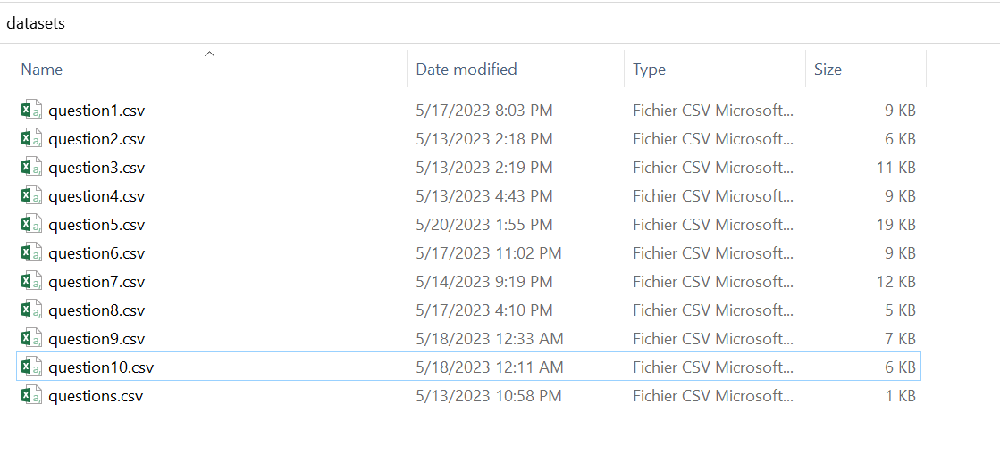

<p align="center">
	
</p>

# Arabic Automated Short Answers Grading System

Arabic Automated Short Answers Grading System for **Moroccan History**, the idea behind this system is to give the adequate grade to the students according to their answers, the system should be in Arabic, and we should prepare our own dataset.

- Scraping data from several sources: Arabic websites, Datasets, books, etc.
- Establishment of Arabic Natural language processing pipeline.
- Word embedding and encoding.
- Model Training based on classical machine learning algorithms.
- Evaluation of the models then the choice of the best one
- Model deployment and consumption via spa web application.

**Tools :** FastAPI, GraphQL, Angular, Tailwindcss, Docker, Github, Scrapy, NLTK, Word2Vec.

## Table of contents

[Scraping Data](#scraping-data)

[Establishment of Arabic Natural language processing pipeline](#establishment-of-arabic-natural-language-processing-pipeline)

[Exploratory data analysis (EDA)](#exploratory-data-analysis)
* [Loading Data](#loading-data)
* [Characteristics Of Dataset](#characteristics-of-dataset)
* [Data Cleaning](#data-cleaning)

[Data Pre-Preprocessing](#data-pre-preprocessing)
* [Split Data](#split-data)

[build Models](#build-models)
* [Testing  Models](#testing-models)
* [Saving The Best Model](#saving-the-best-model)

[Backend of our Application](#backend-of-our-application)
* [FastAPI](#fastapi)
* [GraphQL Server Side](#graphql-server-side)
* [Docker Server Side](#docker-server-side)

[Frontend of our Application](#frontend-of-our-application)
* [Angular](#angular)
* [GraphQL Client Side](#graphql-client-side)
* [Docker Client Side](#docker-client-side)

[Testing the Application](#testing-the-application)
* [Home Page](#home-page)
* [Question Page](#question-page)
* [Result Page](#result-page)


[Contributors](#contributors)

## Scraping data

In our project, one of the most challenging tasks we encountered was the **collection of training data** for our machine learning models. Gathering a sufficient amount of high-quality data was crucial for the success of our project. 

To address this challenge, we devised a strategy that involved creating two **Google Forms** and distributing them to high school students. We carefully designed the forms to elicit specific responses to ten questions related to our project objectives.

By involving high school students in our data collection process, we aimed to gather diverse perspectives and insights. We believed that their input would contribute to the development of robust and inclusive machine learning models. To ensure a balanced dataset, we made efforts to augment the data ourselves by including multiple responses.

Our data collection efforts yielded the following results for each question:

- First question: We successfully collected 140 responses.
- Second question: We received 90 responses.
- Third question: We obtained 90 responses.
- Fourth question: We gathered 70 responses.
- Fifth question: We accumulated 135 responses.
- Sixth question: We obtained 140 responses.
- Seventh question: We received 100 responses.
- Eighth question: We gathered 90 responses.
- Ninth question: We obtained 100 responses.
- Tenth question: We accumulated 103 responses.

These numbers demonstrate the substantial effort we put into gathering a diverse and representative dataset for training our machine learning models. By collecting a significant number of responses for each question, we aimed to ensure that our models would be able to generalize well and handle a wide range of scenarios.

Google Forms 

[Moroccan History I](https://docs.google.com/forms/d/1sHBFL16lalIL0x4xjwy-BtyyUn5SxL-7Fn_9zsHeDkQ)

[Moroccan History II](https://docs.google.com/forms/d/1ySQAQuFEVwdFJiWLnHFzaAP741XazPk3pj-_EYTqIG8)




## Establishment of Arabic Natural language processing pipeline

**pipeline** refers to a sequence of steps or processes that are applied successively to solve a specific problem. A machine learning pipeline is a series of operations that enable data processing, model training, and prediction on new data.


In our project, we approached each question as an individual model, treating them as separate entities. This approach allowed us to focus on the specific requirements and characteristics of each question and develop tailored solutions accordingly. I will now outline the process we followed for Question 1, which was repeated for the other questions as well.

### Exploratory Data Analysis

### Loading Data


### Characteristics Of Dataset


dataset is balanced

### Data Cleaning

For data cleaning, we performed two essential tasks to ensure better performance for our model: removing duplicate values and handling null values.


### Data Pre-Preprocessing

Data preprocessing is a crucial step in machine learning that involves preparing and transforming raw data into a suitable format for model training. It aims to improve the quality and usability of the data by addressing various issues such as missing values, outliers, inconsistencies, and irrelevant features. Data preprocessing plays a significant role in enhancing the performance and accuracy of machine learning models.

In our data processing pipeline, we utilized the **`nltk.tokenize`** module's **`word_tokenize`** function for tokenization , This function allowed us to break down sentences or paragraphs into individual words or tokens. By using **`word_tokenize`**, we obtained a list of tokens, where each token represented a distinct word in the text.  

We utilized also  the **`gensim.models`** module's **`Word2Vec`** class for word embedding generation.

def txt_preprocess(text):
text = text.lower()
tokens = word_tokenize(text)
return tokens

```python
def txt_preprocess(text):
text = text.lower()
tokens = word_tokenize(text)
return tokens
```

```python
model_word2vec = Word2Vec(df['tokens'], vector_size=100, window=5, min_count=1, workers=4)
```

the result was 


### Split Data

To split the data for training and testing purposes, considering our relatively small dataset, we allocated 15% of the data for testing and the remaining portion for training the model.

```python
train_data = df.sample(frac=0.85, random_state=42)
test_data = df.drop(train_data.index)
```

### build Models

For the training phase, I employed multiple machine learning models to determine the best-performing one. The models I utilized for classification included Random Forest, SVM with a linear kernel, SVM with an RBF kernel, K-Nearest Neighbors (KNN), Naive Bayes, Decision Tree, Artificial Neural Network, and ensemble learning with bagging.

By leveraging a variety of models, each with its unique characteristics and learning algorithms, I aimed to explore different approaches to classification and identify the model that exhibited the highest performance on the given task. 

```python
def getModel(name):
if name == 'svm_linear':
model_svm_linear = SVC(kernel='linear' ,probability=True)
model_svm_linear.fit(X_train, Y_train)
return model_svm_linear
elif name == 'svm_rbf':
model_svm_rbf = SVC(kernel='rbf' , probability=True)
model_svm_rbf.fit(X_train, Y_train)
return model_svm_rbf
elif name == 'random_forest':
model_rf = RandomForestClassifier(n_estimators=100, random_state=42)
model_rf.fit(X_train, Y_train)
return model_rf
elif name == 'knn':
model_knn = KNeighborsClassifier(n_neighbors=15)
model_knn.fit(X_train, Y_train)
return model_knn
elif name == 'naive_bayes':
model_nb = GaussianNB()
model_nb.fit(X_train, Y_train)
return model_nb
elif name == 'bagging':
# Créer le modèle de base
base_model = DecisionTreeClassifier()
model_bagging = BaggingClassifier(base_estimator=base_model, n_estimators=10, random_state=42)
# Entraîner le modèle Bagging
model_bagging.fit(X_train, Y_train)
return model_bagging
elif name == 'ann':
# MLP: création + entrainement
model_ANN = MLPClassifier(hidden_layer_sizes=(15, 10), random_state=1, max_iter=800)
model_ANN.fit(X_train , Y_train)
return model_ANN
elif name == 'decision_tree':
model_dt = DecisionTreeClassifier()
model_dt.fit(X_train, Y_train)
return model_dt
else:
raise ValueError("Invalid model name.")
```

```python
models = [
getModel('svm_linear'),
getModel('svm_rbf'),
getModel('random_forest'),
getModel('knn'),
getModel('naive_bayes'),
getModel("ann"),
getModel('bagging'),
getModel('decision_tree')
]
models_names = [
'SVM Linear',
'SVM RBF',
'Random Forest',
'KNN',
'Naive Bayes',
'ANN',
'Ensemble Learning (Bagging)',
'Decision Tree'
]
```

Evaluating the performance of these models is crucial to assess their effectiveness and determine their suitability for the given problem. One commonly used metric for measuring model performance is accuracy and AUC Area under the ROC Curve. Accuracy provides an indication of how well the model predicts the correct outcomes compared to the total number of predictions made.

 In the following sections, we will analyze and compare the accuracy of the different models we employed, shedding light on their strengths and weaknesses in handling the task at hand.

```
accuracy SVM Linear :  0.35
accuracy SVM RBF :  0.8
accuracy Random Forest :  0.7
accuracy KNN :  0.65
accuracy Naive Bayes :  0.65
accuracy ANN :  0.8
accuracy Ensemble Learning (Bagging) :  0.6
accuracy Decision Tree :  0.45
```

```
SVM Linear  Aire sous la courbe ROC: 0.7455357142857141
SVM RBF  Aire sous la courbe ROC: 0.9097222222222222
Random Forest  Aire sous la courbe ROC: 0.8663194444444445
KNN  Aire sous la courbe ROC: 0.8296130952380952
Naive Bayes  Aire sous la courbe ROC: 0.8492063492063492
ANN  Aire sous la courbe ROC: 0.9126984126984127
Ensemble Learning (Bagging)  Aire sous la courbe ROC: 0.8645833333333334
Decision Tree  Aire sous la courbe ROC: 0.6994047619047619
```

To select the best model, I relied on **accuracy** as a performance metric. However, I also took into consideration the risk of overfitting by using **auc** metric , and aiming to avoid models with accuracy close to 100%. To ensure a comprehensive evaluation, I created a small test dataset characterized by its diversity. I applied this test dataset to all the models, carefully assessing their performance. Ultimately, I selected the model that demonstrated the highest accuracy without approaching the 100% mark, as this could indicate overfitting. By utilizing this approach, I aimed to strike a balance between accuracy and generalization, ultimately identifying the model that exhibited the best performance on the given task.

| quetions | accuracy | best model |
| --- | --- | --- |
| 1 | 0.8 | SVM RBF |
| 2 | 0.9 | Naive Bayes |
| 3 | 0.75 | Naive Bayes |
| 4 | 0.77 | Random Forest |
| 5 | 0.74 | ANN |
| 6 | 0.73 | ANN |
| 7 | 0.88 | Random Forest |
| 8 | 0.81 | SVM RBF |
| 9 | 0.85 | SVM RBF |
| 10 | 0.85 | ANN |

### Testing Models


### Saving The Best Model

To save the best model, I utilized [The pickle library](https://docs.python.org/3/library/pickle.html) . The pickle library in Python provides a straightforward way to serialize and store Python objects, including machine learning models, as binary files. By using pickle, I was able to save the trained model to disk for later use without having to retrain it from scratch.

[The pickle library](https://docs.python.org/3/library/pickle.html) allows me to save the entire model object, including its architecture, parameters, and trained weights, in a compact binary format. This serialized representation can be easily stored on disk or transferred across different systems or environments.

```python
model_path = '../saved_models/model_question1.h5'
with open(model_path, 'wb') as file:
pickle.dump((model_svm_rbf, model_word2vec), file)
```

```python
with open(model_path, "rb") as file:
        model, model_word2vec = pickle.load(file)
```


## Backend of our application

### FastAPI

For the backend we choose **FastAPI** framework ****because it’s fast to learn and to use.


First we create a virtual environment :

```
python -m venv venv
```

We have to activate the new virtual environment by executing the command :

```
venv/Scripts/Activate.ps1
```

Concerning the python libraries we used, this is the `requirements.txt` file of our backend application :

```
anyio==3.6.2
click==8.1.3
colorama==0.4.6
fastapi==0.95.1
gensim==4.3.1
graphql-core==3.2.3
h11==0.14.0
httptools==0.5.0
idna==3.4
joblib==1.2.0
nltk==3.8.1
numpy==1.24.3
pandas==2.0.1
pydantic==1.10.7
python-dateutil==2.8.2
python-dotenv==1.0.0
pytz==2023.3
PyYAML==6.0
regex==2023.5.5
scikit-learn==1.2.2
scipy==1.10.1
six==1.16.0
smart-open==6.3.0
sniffio==1.3.0
starlette==0.26.1
strawberry-graphql==0.177.1
threadpoolctl==3.1.0
tqdm==4.65.0
typing_extensions==4.5.0
tzdata==2023.3
uvicorn==0.22.0
watchfiles==0.19.0
websockets==11.0.3
```

### GraphQL Server Side

To send request from the frontend to backend we used **GraphQL** a query language for APIs and a runtime for fulfilling those queries with the existing data.

We implemented it in our application with the library ************Strawberry.************ It’s a new **GraphQL** library for Python 3, inspired by dataclasses.


### Docker Server Side

To build and run our application we used **Docker.**

We create a `Dockerfile` and `docker-compose.yml` file.

The `Dockerfile` contains the following code :

```
FROM python

# Set the working directory in the container
WORKDIR /app

# Copy the requirements file to the container
COPY ./requirements.txt .

# Install dependencies
RUN pip install -r requirements.txt

# Copy the rest of the project files to the container
COPY . .

# Expose the port that the application will be running on
EXPOSE 8000
```

The `docker-compose.yml` contains the following code :

```
version: '3.10'
services:
  app:
    build: .
    command: uvicorn main:app --host 0.0.0.0
    ports:
      - "8000:8000"
```

To build and run the application in **************Docker************** we used the following command :

```
docker-compose up
```

 


## Frontend of our application

### Angular

For the frontend we choose **Angular** and ************************TailwindCSS************************ framework.


### GraphQL Client Side

To use **************GraphQL************** in the client side we needed also to download a library called `apollo-angular` so we did using this command :

```
ng add apollo-angular
```

 We needed to set the URL of our GraphQL Server in the `src/app/graphql.module.ts` file :

```
const uri = 'http://localhost:8000'; // <-- the URL of our GraphQL server
```

### Docker Client Side

To build and run our frontend application we created a `Dockerfile` containing the following code :

```
# Build stage
FROM node:18.13.0-alpine as build
RUN mkdir -p /app

WORKDIR /app

COPY package.json /app/
RUN npm install

COPY . /app/
RUN npm run build --prod

# Prod stage
FROM nginx:alpine
COPY --from=build /app/dist/answers-grading-system-frontend /usr/share/nginx/html
```

To build the application in **************Docker************** we use the following command :

```
docker build --tag answers-grading-system-frontend .
```


To run it we used :

```
docker run -d -p 4200:80 --name answers-grading-system-frontend answers-grading-system-frontend
```


## Testing the Application

### Home Page


### Question Page

By clicking on the button ****ابدأ الاختبار**** the test will begin :


### Result Page

By clicking on the button ****عرض النتيجة**** the grades given by the models we trained will showed with the correct answers :


## Contributors

<a href="https://github.com/ahmed-bentajhamyani/answers-grading-system-application/graphs/contributors">
  
</a>

